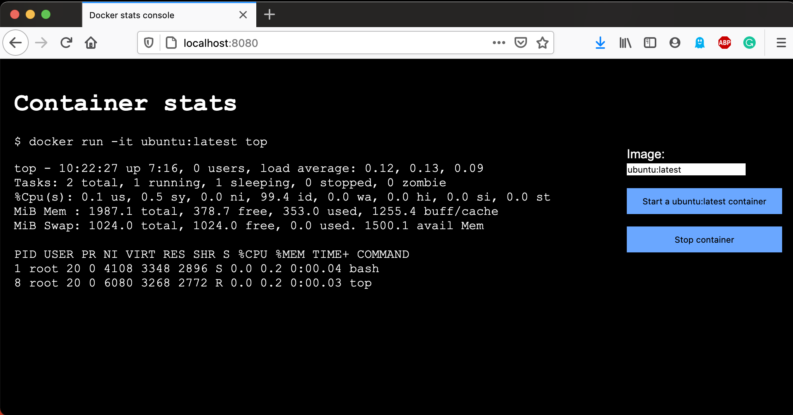

# docker-client-project

The project has two Maven modules:
- **docker-java-client**: Java client to consume the Docker API methods.
- **ubuntu-stats-app**: Web application that serves the Ubuntu CPU/Memory stats to a simple web UI.

Both components are using Spring Boot.

## docker-java-client

This client uses the Apache HTTP client to interact with the Docker socket that usually is located at `/var/run/docker.sock`.
It can be [configured as any other Spring Boot application](https://docs.spring.io/spring-boot/docs/2.4.0/reference/html/spring-boot-features.html#boot-features-external-config)
to override this default path and it allows to configure the version of the API to consume.
You can check the available configuration parameters [here](docker-java-client/src/main/resources/application.properties).

This is an example of usage:

```java
@Autowired
Docker docker;

// Pull an image. Gets blocked until completion.
docker.images().pull("openjdk", "14-alpine");

// Runs a container
String containerId = docker.containers().create("java-instance", "openjdk:14-alpine");
this.docker.containers().start(containerId);

// Execute some command
String execId = this.docker.containers().exec(containerId, "ls");
DockerResponse response = this.docker.execs().startInteractive(execId);

// You can do whatever you want with the DockerResponse object obtained.
// In this case we started an interactive command so the stream is open and
// information flows until you close it.
response.getContent(); // <- This is a stream
response.close();
// The response is autocloseable, but as we use .startInteractive() we may want to consume
// the info for a long time, for example to show CPU stats.

// Now we can clean up
docker.containers().stop(containerId);
docker.containers().remove(containerId);
```

The API methods available in the client are fully documented in their respective interfaces, so you can have a
look [here](docker-java-client/src/main/java/com/adambarreiro/docker/client/api). As the API is huge, only a few
methods have been implemented, but adding new ones is fairly easy.

## ubuntu-stats-app

This Spring Boot application offers a simple UI made with a small component done with a few features from [Vue.js](https://vuejs.org/),
as it extremely easy to render the displayed information dynamically with that framework.



The information shown is transferred through websockets. The server exposes some endpoints to route the container stats
to the sockets, using [STOMP protocol](http://stomp.github.io/) and [SockJS](https://github.com/sockjs/sockjs-client) in the UI client.

Websockets were chosen for this use case because they provide real time updates for the container output, and the result
is quite nice.

In the current implementation, only one socket can be handled simultaneously as the pool is limited to 1
thread. This can be easily changed, though.

## Testing

Both modules have unit testing and the `ubuntu-stats-app` has also integration tests that **require you to have
the Docker engine running**.

## Usage

Please execute these commands depending on what you would like to do:

- `make build`: Execute the Maven build. This step is required to build the Docker image.
- `make run`: Runs the JAR with your Java installation. You'll need JDK 11.
- `make docker-build`: Builds the Docker image with the built JAR.
- `make docker-run`: Runs the Docker container with the application. It assumes you have Docker listening at `/var/run/docker.sock`.
- `make test`: Execute the unit/integration tests only.
- `make coverage-report`: Opens the JaCoCo reports in web browser. Runs a build if the reports are not present.
- `make bugs`: Checks and opens the SpotBugs report.

## Improvements

- Would be nice to refactor the Docker client to implement a more fluid API (builder pattern), for example:
```
docker.images().pull("ubuntu","latest").create().start();
```
- Missing some Docker API endpoints (only the required for the ubuntu-stats-app are available).
- Security on websocket communication.
- `top` command output handling can be improved, right now the UI is parsing it instead of just printing a structured JSON.
- Allow more than 1 container to be started.
